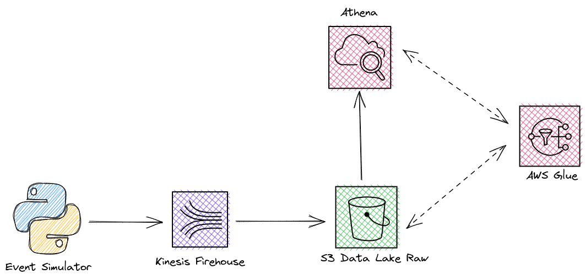
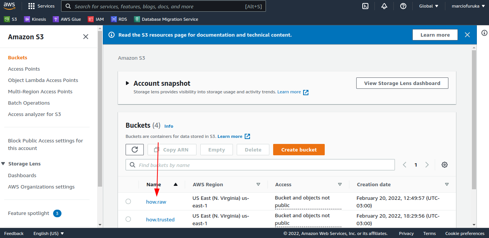
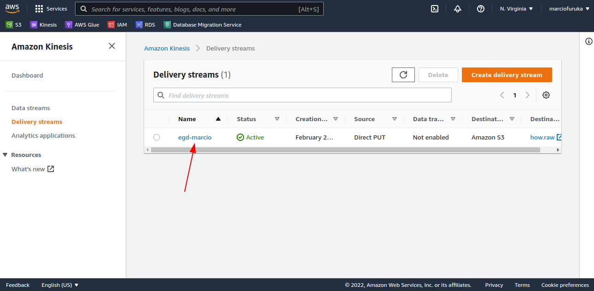
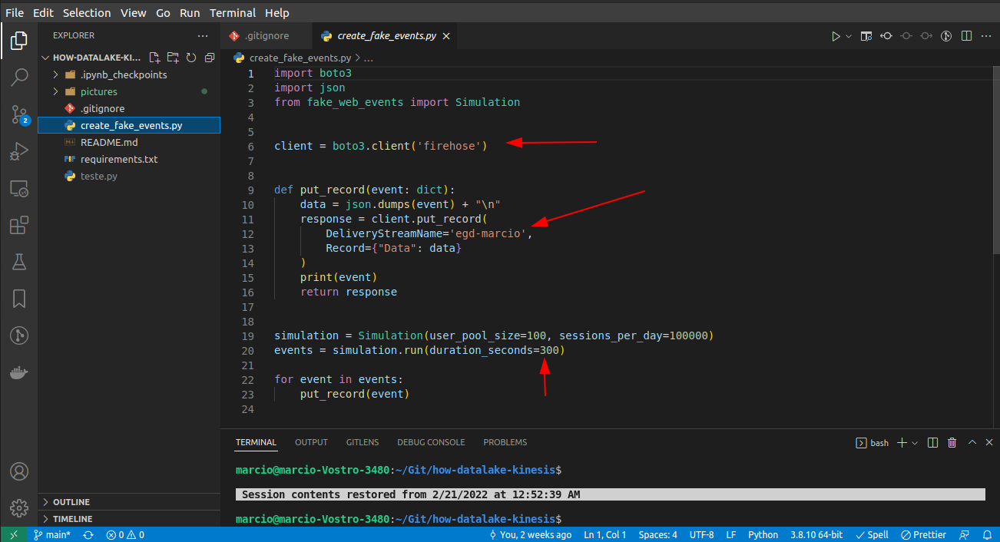
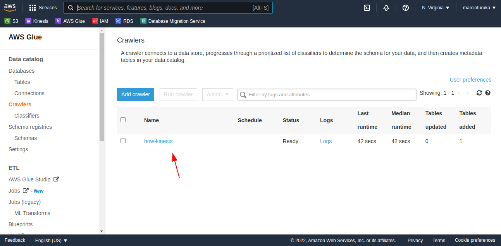
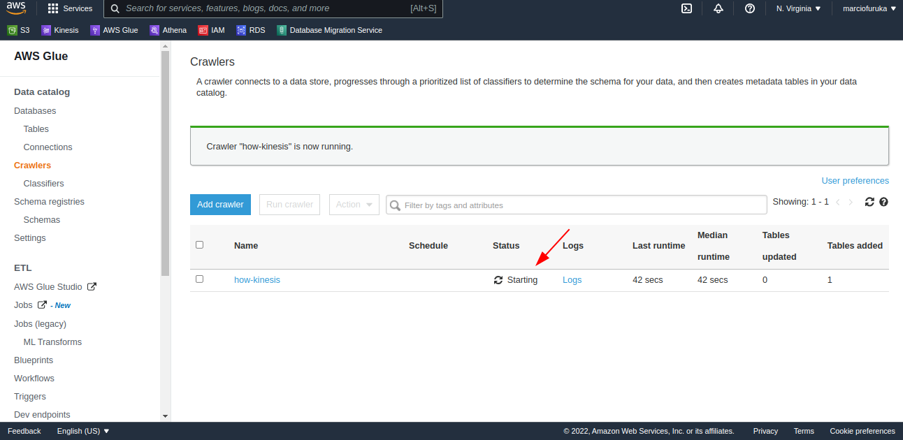
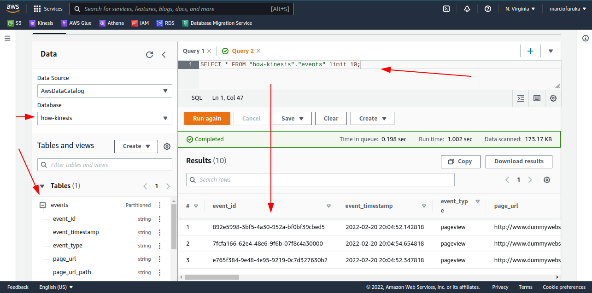

# how-datalake-kinesis

Created for studying and reproduce some exercises during the [How Edu](https://howedu.com.br/) Bootcamp.
Here we're using AWS services:

- S3
- Kinesis
- Glue
- Athena

It's a low-code solution using the Amazon Web Services.

# Architecture Model

# How it works

We're using the [fake_web_events](https://pypi.org/project/fake-web-events/) simulator to create some events that'll be collected by Kinesis Firehouse and put them in the Data Lake Raw Layer.

We're not going to work in sharping the data, just seeing some fields in AWS Athena and automating some process in AWS Glue.

# Exercise and AWS configurations step-by-step

1. Create a S3 bucket:
   - Block public access
   - Enable bucket versioning
   - Enable encryption (SSE-S3)

2. Create a Kinesis Firehose Delivery Stream:
   - Delivery Stream Name: `[name]`
   - Source: Direct PUT
   - Destination: Amazon S3
   - S3 bucket: `[path-of-bucket-created]`
   - S3 bucket prefix: `events/landing-date=!{timestamp:yyyy}-!{timestamp:MM}-!{timestamp:dd}/`
   - S3 bucket error output prefix: error
   - Buffer size: 1
   - Buffer interval: 60
   - Compression: GZIP

3. Execute the python code:
   - Put the Kinesis Stream Name in the code
   - It'll run during 5 minutes and Kinesis is going to capture data every 1 minute

4. Create an AWS Glue Crawler:
   - Crawler name: create name
   - Data store: S3
   - Include path `[bucket/events]`
   - Create an IAM role if it doesn't exist
   - Frequency: Run on demand
   - Database name: create name
   - Update all new and existing partitions with metadata from the table: true

5. Run crawler
   - It'll be created the database and events table

6. Athena
   - Configure the bucket where the query results should be saved
   - Run the query using the catalog

